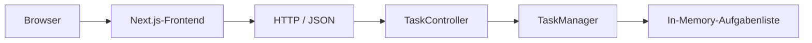

# Systemarchitektur

Der Browser zeigt die Benutzeroberfläche des Next.js-Frontends an. Das Frontend kommuniziert über HTTP und JSON mit dem `TaskController` im Spring-Boot-Backend. Der Controller leitet die Anfragen an den `TaskManager` weiter. Der `TaskManager` enthält die Geschäftslogik und verwaltet die Aufgaben in einer Liste im Arbeitsspeicher.
