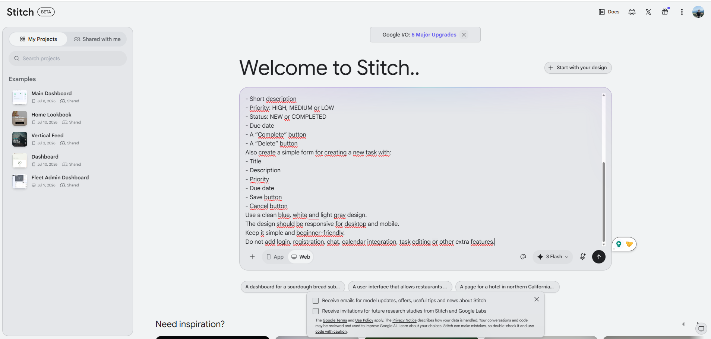
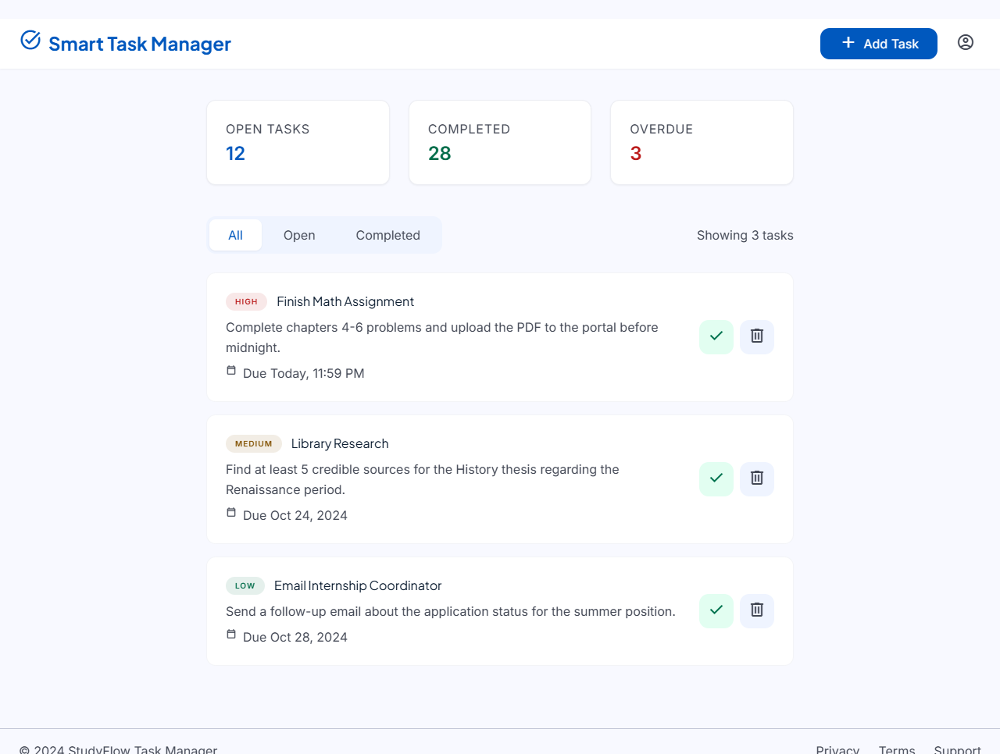
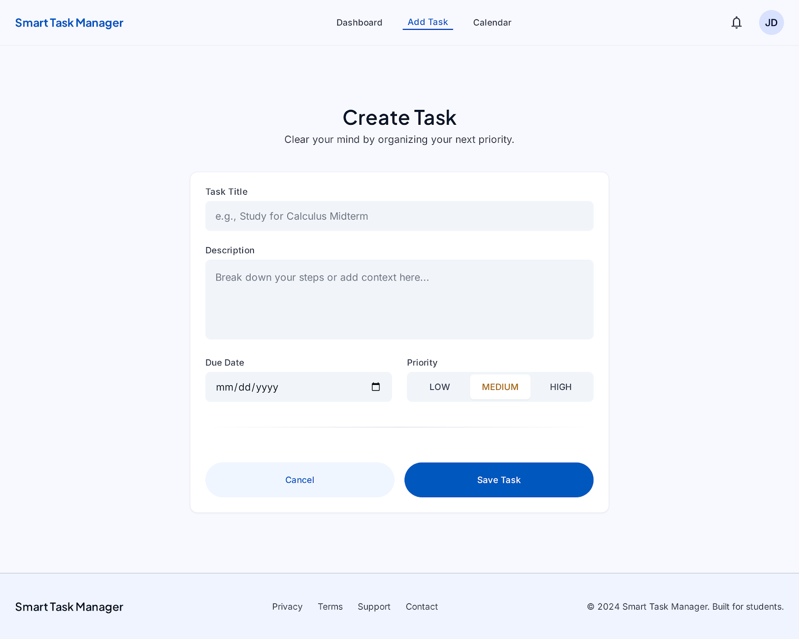

# Teil A – GUI-Prototyp mit Google Stitch

## Ziel

Für den Smart Task Manager sollte zuerst ein einfacher visueller Prototyp erstellt werden. Der Prototyp dient später als Vorlage für das Next.js-Frontend.

## Vorgehen

Ich habe Google Stitch verwendet und zuerst einen detaillierteren Prompt eingegeben. Das erste Ergebnis war für mein Projekt zu komplex. Deshalb habe ich den Prompt vereinfacht und einen übersichtlicheren Dashboard-Entwurf erstellen lassen.

Danach habe ich zusätzlich einen zweiten Screen für das Erstellen einer Aufgabe erzeugt.

## Verwendete Prompts

[Alle verwendeten Google-Stitch-Prompts öffnen](../prompts/01-google-stitch.md)

## Nachweis der Nutzung

## Finaler Dashboard-Prototyp

Der vereinfachte Entwurf zeigt eine Aufgabenliste, Prioritäten, Fälligkeitsdaten, Filter sowie Funktionen zum Erledigen und Löschen einer Aufgabe.

## Finaler Create-Task-Screen

Der zweite Screen enthält die Felder Titel, Beschreibung, Priorität und Fälligkeitsdatum sowie die Schaltflächen zum Speichern und Abbrechen.

## Exportierte Stitch-Dateien

Die exportierten Dateien bleiben im Projekt, damit sie beim Erstellen des Next.js-Frontends als Designvorlage verwendet werden können.

- [Design-System](../../design/stitch/DESIGN.md)
- [Dashboard-HTML](../../design/stitch/dashboard/code.html)
- [Create-Task-HTML](../../design/stitch/create-task/code.html)

## Persönliche Erfahrung

Der erste Entwurf sah modern aus, war für mein Projekt aber zu umfangreich. Durch einen zweiten, einfacheren Prompt wurde das Ergebnis übersichtlicher und realistischer für die spätere Umsetzung mit Next.js.

[Zurück zur Haupt-README](../../README.md)
