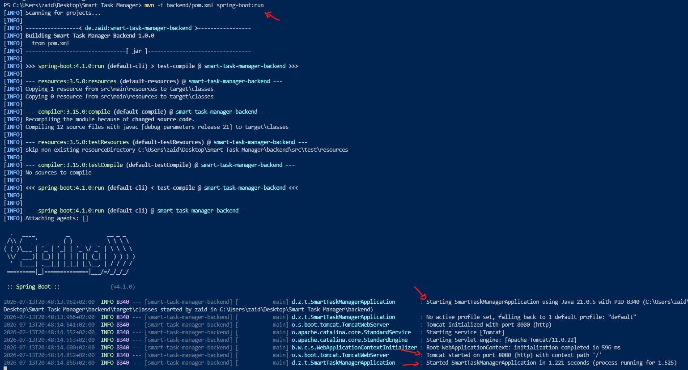
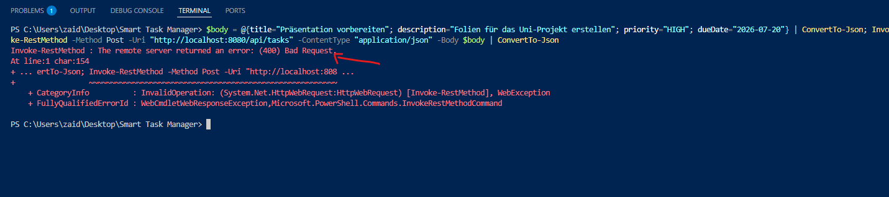
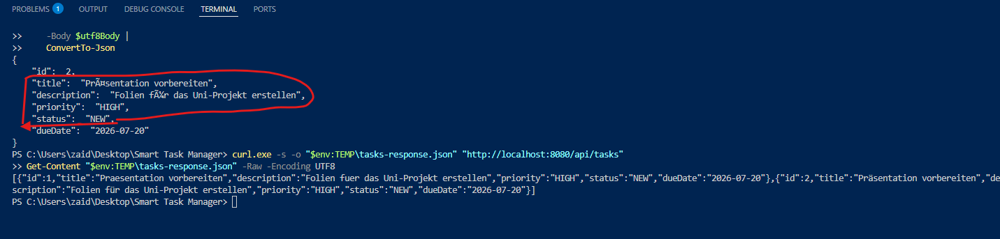
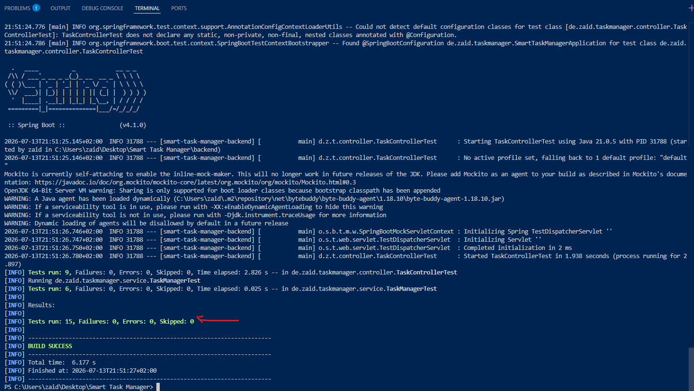

# REST-API und automatisierte Tests

## Ziel

Das Spring-Boot-Backend wurde über HTTP und JSON nutzbar gemacht. Anschließend wurden sowohl die Geschäftslogik als auch die REST-Endpunkte durch automatisierte Tests geprüft.

## API-Struktur

- `TaskController` verarbeitet die HTTP-Anfragen und verwendet für die fachlichen Operationen den `TaskManager`.
- `CreateTaskRequest` nimmt die Daten zum Erstellen einer Aufgabe entgegen und prüft die erforderlichen Eingaben.
- `TaskResponse` überträgt Aufgabendaten als API-Antwort, ohne das interne Modell direkt freizugeben.
- `ApiError` stellt Fehlerantworten mit Zeitstempel, Status, Fehler und Nachricht einheitlich dar.
- `TaskNotFoundException` signalisiert, dass eine Aufgabe mit der angegebenen ID nicht gefunden wurde.
- `GlobalExceptionHandler` verarbeitet Fehler zentral und wandelt sie in passende HTTP-Antworten um.

Der Controller ist für die HTTP-Verarbeitung zuständig. Die Geschäftslogik bleibt weiterhin im `TaskManager`. DTOs trennen das interne Modell von den Daten der API, während die Fehlerbehandlung zentral organisiert ist.

## REST-Endpunkte

| Methode | Endpunkt | Funktion | Erfolgsstatus |
|---|---|---|---|
| POST | `/api/tasks` | Aufgabe erstellen | `201 Created` |
| GET | `/api/tasks` | Aufgaben anzeigen | `200 OK` |
| GET | `/api/tasks?sort=priority` | Nach Priorität sortieren | `200 OK` |
| GET | `/api/tasks?sort=dueDate` | Nach Fälligkeitsdatum sortieren | `200 OK` |
| PATCH | `/api/tasks/{id}/complete` | Aufgabe abschließen | `200 OK` |
| DELETE | `/api/tasks/{id}` | Aufgabe löschen | `204 No Content` |

## Fehlerbehandlung

- Ungültige Request-Daten führen zu `400 Bad Request`.
- Ein unbekannter Sortierwert führt zu `400 Bad Request`.
- Eine unbekannte Aufgaben-ID führt zu `404 Not Found`.
- Fehlerantworten werden einheitlich über `ApiError` ausgegeben.

## Praktische Prüfung

Folgende Funktionen wurden manuell geprüft:

- Backend erfolgreich auf Port 8080 gestartet
- Aufgabe mit `POST` erstellt
- Aufgaben mit `GET` gelesen
- Aufgabe mit `PATCH` abgeschlossen
- Aufgabe mit `DELETE` gelöscht
- Soft-Delete durch ein erneutes `GET` bestätigt







## Dokumentierter Fehler während der Umsetzung

Beim ersten `POST`-Request mit deutschen Umlauten antwortete die API mit `HTTP 400 Bad Request`.

Die Serverantwort war:

```json
{
  "timestamp": "2026-07-13T21:06:42.7261659",
  "status": 400,
  "error": "Bad Request",
  "message": "Request body contains invalid data"
}
```

Die Fehlersuche erfolgte in dieser Reihenfolge:

1. Derselbe Request wurde zunächst mit reinen ASCII-Zeichen getestet.
2. Der Request mit ASCII-Zeichen funktionierte.
3. Danach wurde der JSON-Body ausdrücklich als UTF-8 übertragen.
4. Die Aufgabe mit deutschen Umlauten wurde erfolgreich erstellt.
5. Windows PowerShell stellte die Umlaute in der direkten Ausgabe von `Invoke-RestMethod` zunächst falsch dar.
6. Die Antwort wurde deshalb mit `curl.exe` in einer Datei gespeichert.
7. Die Datei wurde mit `Get-Content` und `-Encoding UTF8` gelesen.
8. Dadurch wurde bestätigt, dass das Backend die Umlaute korrekt gespeichert hatte.

Die Untersuchung wies auf ein Kodierungs- oder Darstellungsproblem im verwendeten PowerShell-Client hin. Es lag kein Fehler im `TaskManager` oder in der REST-Geschäftslogik vor. Die explizite UTF-8-Ausgabe bestätigte die korrekt gespeicherten Daten. Die genaue technische Ursache wurde dabei nicht zweifelsfrei bewiesen.

## Automatisierte Tests

### TaskManagerTest

Die 6 Tests prüfen:

- fortlaufende IDs
- Rückgabe aktiver Aufgaben
- Soft-Delete
- Abschließen einer Aufgabe
- Sortierung nach Priorität
- Sortierung nach Fälligkeitsdatum

### TaskControllerTest

Die 9 Tests prüfen:

- `POST /api/tasks`
- `GET /api/tasks`
- Sortierung nach Priorität
- Sortierung nach Fälligkeitsdatum
- `PATCH /api/tasks/{id}/complete`
- `DELETE /api/tasks/{id}`
- `400 Bad Request` bei ungültigen Request-Daten
- `400 Bad Request` bei unbekanntem Sortierwert
- `404 Not Found` bei unbekannter Aufgaben-ID

## Testergebnis

```text
Tests run: 15
Failures: 0
Errors: 0
Skipped: 0
BUILD SUCCESS
```



## Kursbegriffe

- **Separation of Concerns:** HTTP-Verarbeitung, Geschäftslogik, Datenübertragung, Modell und Fehlerbehandlung sind getrennt.
- **Single Responsibility Principle:** Jede Klasse besitzt eine klar abgegrenzte Aufgabe.
- **DTO:** `CreateTaskRequest`, `TaskResponse` und `ApiError` übertragen API-Daten, ohne das interne Modell direkt freizugeben.
- **Geringe Kopplung:** Der Controller verwendet den Service über eine klar begrenzte Schnittstelle.
- **Hohe Kohäsion:** Zusammengehörige Klassen befinden sich in den Paketen `controller`, `dto`, `exception`, `model` und `service`.
- **Automatisierte Tests:** Wiederholbare Tests prüfen Geschäftslogik und HTTP-Verhalten.
- **Fehlerbehandlung:** Fehler werden zentral und einheitlich in HTTP-Antworten umgewandelt.

## Persönliche Erfahrung

Die REST-Endpunkte konnten auf der vorhandenen Geschäftslogik aufgebaut werden. Besonders hilfreich waren die automatisierten Tests, weil dadurch sowohl die Geschäftslogik als auch die HTTP-Endpunkte geprüft wurden. Der Fehler mit den Umlauten zeigte außerdem, dass Probleme nicht immer direkt im Backend liegen, sondern auch durch den verwendeten Client entstehen können.

## Links

- [Verwendete Prompts öffnen](../prompts/04-rest-api-und-tests.md)
- [Java-Backend-Struktur öffnen](03-java-backend-struktur.md)
- [Systemarchitektur öffnen](../diagrams/systemarchitektur.md)
- [Zurück zur Haupt-README](../../README.md)
