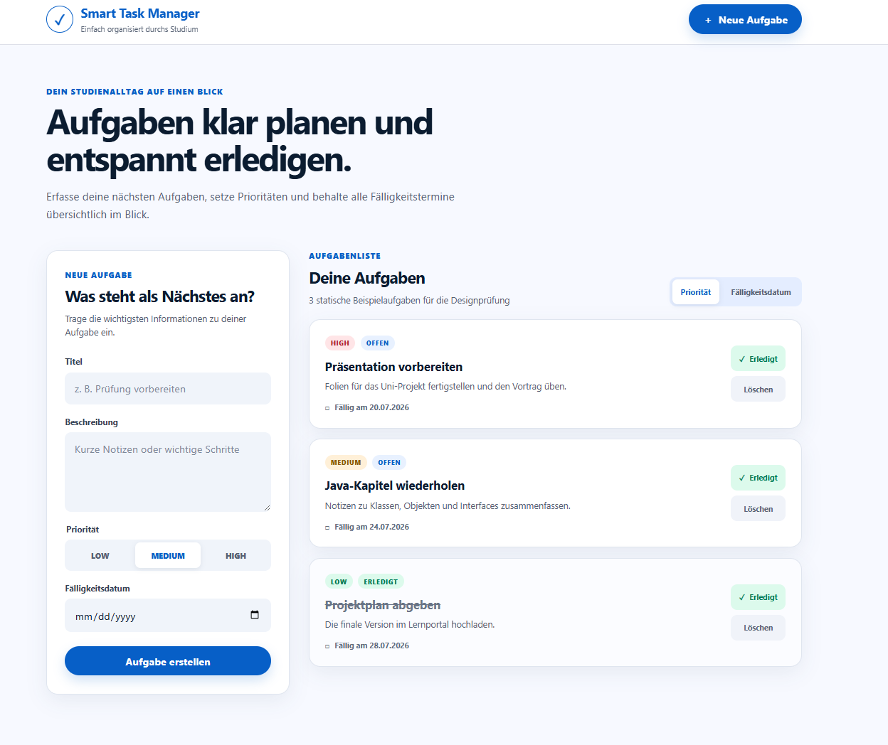

# Statisches Frontend mit Next.js

## Ziel

Für den Smart Task Manager wurde ein eigenständiges Next.js-Frontend erstellt. In diesem Schritt stand zunächst die Benutzeroberfläche im Mittelpunkt. Die Verbindung zum Spring-Boot-Backend folgt erst im nächsten Schritt.

## Verwendete Technologien

- Next.js 16.2.10
- React 19.2.7
- TypeScript
- App Router
- ESLint
- normales CSS ohne zusätzliche UI-Bibliothek
- npm

## Designgrundlage

Die Oberfläche orientiert sich am zuvor mit Google Stitch erstellten Entwurf. Die exportierten Stitch-Dateien und Screenshots wurden als visuelle Vorlage verwendet, während die eigentliche Oberfläche als React-Komponenten neu umgesetzt wurde.

- [Google-Stitch-Schritt öffnen](01-gui-prototyp-mit-google-stitch.md)
- [Exportiertes Stitch-Design öffnen](../../design/stitch/DESIGN.md)

## Frontend-Struktur

```text
frontend/
├── .gitignore
├── eslint.config.mjs
├── next.config.ts
├── next-env.d.ts
├── package.json
├── package-lock.json
├── tsconfig.json
└── src/
    ├── app/
    │   ├── globals.css
    │   ├── layout.tsx
    │   └── page.tsx
    └── components/
        ├── CreateTaskForm.tsx
        ├── Header.tsx
        ├── TaskCard.tsx
        └── TaskList.tsx
```

## React-Komponenten

- `Header` zeigt Titel, Unterzeile und die Schaltfläche „Neue Aufgabe“.
- `CreateTaskForm` enthält Felder für Titel, Beschreibung, Priorität und Fälligkeitsdatum.
- `TaskList` zeigt die Aufgaben und die beiden Sortierschaltflächen.
- `TaskCard` stellt eine einzelne Aufgabe und ihre Aktionen dar.
- `page.tsx` setzt die Komponenten zusammen und stellt in diesem Schritt statische Beispieldaten bereit.
- `globals.css` enthält das responsive und Stitch-inspirierte Design.

## Aktueller Funktionsstand

In Schritt 05 ist die Oberfläche noch statisch.

Daher funktionieren noch nicht:

- Aufgabe tatsächlich erstellen
- Aufgaben vom Backend laden
- Sortierung ändern
- Aufgabe abschließen
- Aufgabe löschen

Die Eingabefelder können benutzt werden, aber die Schaltflächen lösen noch keine fachliche Aktion aus. Dieses Verhalten war für Schritt 05 beabsichtigt. Die echte Funktionalität folgt in Schritt 06.

## Designnachweis



## Build-Prüfung

```text
npm.cmd --prefix frontend run lint
```

Ergebnis:

```text
Keine ESLint-Fehler
```

Außerdem wurde dieser Build ausgeführt:

```text
npm.cmd --prefix frontend run build
```

Ergebnis:

```text
Compiled successfully
Finished TypeScript
Generating static pages
BUILD erfolgreich
```

Bei der Installation wurden zwei moderate npm-Audit-Hinweise gemeldet. Es wurde kein erzwungenes automatisches Update ausgeführt, weil dadurch möglicherweise inkompatible Änderungen entstanden wären.

## Kursbegriffe

- **Komponenten:** Die Oberfläche wurde in wiederverwendbare React-Komponenten aufgeteilt.
- **Separation of Concerns:** Layout, Formular, Aufgabenliste und einzelne Aufgabenkarte sind getrennt.
- **Single Responsibility Principle:** Jede Komponente besitzt eine klar abgegrenzte Aufgabe.
- **Hohe Kohäsion:** Zusammengehörige Darstellung und Logik befinden sich jeweils in derselben Komponente.
- **Geringe Kopplung:** `TaskList` erhält die Aufgaben über die Property `tasks`, und `TaskCard` erhält eine einzelne Aufgabe über die Property `task`.
- **Wiederverwendung:** `TaskCard` kann für mehrere Aufgaben verwendet werden.
- **Responsives Design:** Die Darstellung passt sich unterschiedlichen Bildschirmgrößen an.

## Persönliche Erfahrung

Die Aufteilung in kleine React-Komponenten machte die Oberfläche übersichtlicher als eine einzelne große Seite. Beim manuellen Test wurde außerdem deutlich, dass eine sichtbare Schaltfläche noch keine echte Funktion bedeutet. Die Oberfläche war in diesem Schritt bewusst statisch und wird erst durch die Verbindung mit dem Backend vollständig nutzbar.

## Links

- [Verwendeten Prompt öffnen](../prompts/05-nextjs-frontend.md)
- [Google-Stitch-Prototyp öffnen](01-gui-prototyp-mit-google-stitch.md)
- [REST-API und Tests öffnen](04-rest-api-und-tests.md)
- [Zurück zur Haupt-README](../../README.md)
