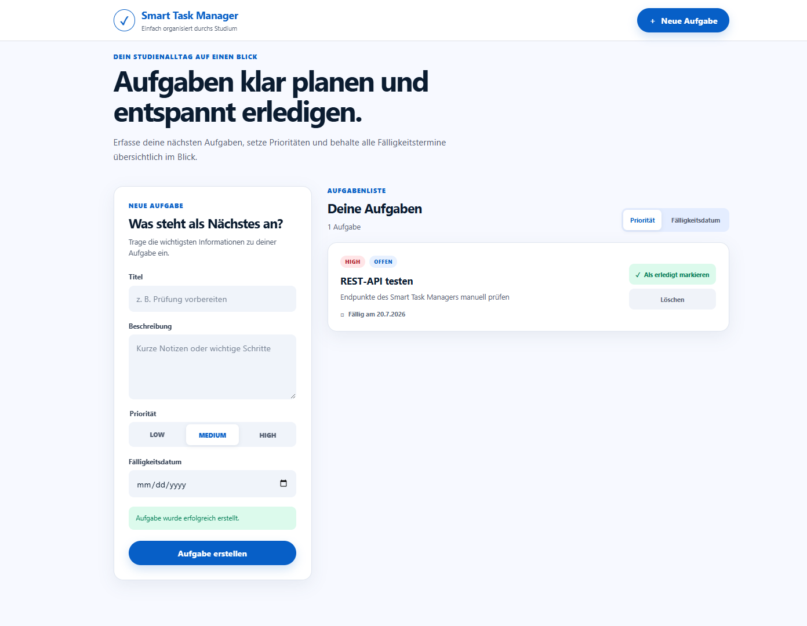
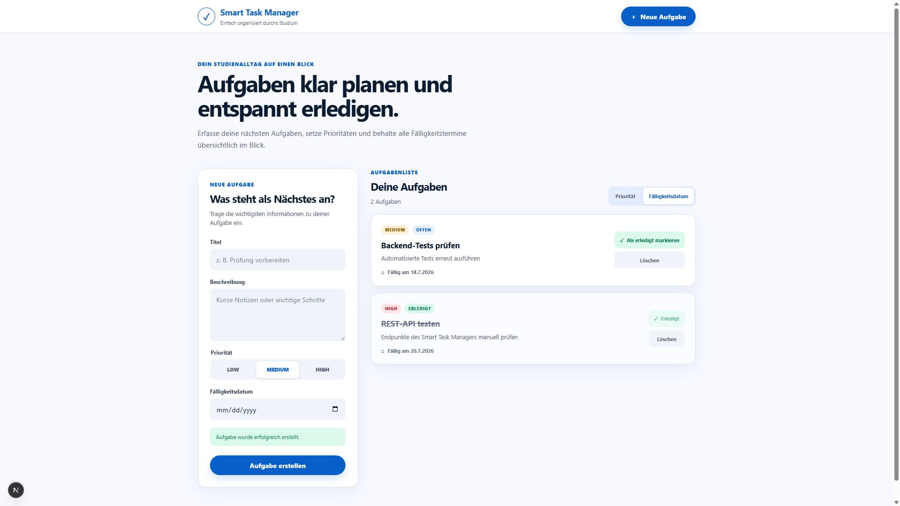

# Frontend-Backend-Kommunikation

## Ziel

Das Next.js-Frontend wurde mit der Spring-Boot-REST-API verbunden. Frontend und Backend laufen als zwei getrennte Anwendungen und kommunizieren über HTTP und JSON.

## Verteilte Anwendung

- Frontend: Next.js auf Port 3000
- Backend: Spring Boot auf Port 8080
- Kommunikation: HTTP und JSON
- Speicherung: In-Memory-Aufgabenliste im Backend

Es handelt sich um eine verteilte Anwendung, weil Frontend und Backend als getrennte Prozesse laufen und über eine Netzwerkschnittstelle miteinander kommunizieren.

## Kommunikationsablauf

```text
Browser
  -> Next.js-Frontend auf Port 3000
  -> HTTP / JSON
  -> Spring-Boot-Backend auf Port 8080
  -> TaskController
  -> TaskManager
  -> In-Memory-Aufgabenliste
```

- [Systemarchitektur öffnen](../diagrams/systemarchitektur.md)

## Neue und geänderte Struktur

Neu erstellt wurden:

```text
backend/src/main/java/de/zaid/taskmanager/config/
└── WebConfig.java

frontend/
├── .env.example
└── src/
    ├── lib/
    │   └── taskApi.ts
    └── types/
        └── task.ts
```

Außerdem wurden diese vorhandenen Dateien angepasst:

- `frontend/src/app/page.tsx`
- `frontend/src/app/globals.css`
- `frontend/src/components/CreateTaskForm.tsx`
- `frontend/src/components/TaskList.tsx`
- `frontend/src/components/TaskCard.tsx`

## Verantwortungen

- `WebConfig` erlaubt CORS ausschließlich für `http://localhost:3000` und die benötigten HTTP-Methoden.
- `taskApi.ts` bündelt die HTTP-Aufrufe zur REST-API.
- `task.ts` enthält die gemeinsamen TypeScript-Typen für Aufgaben und API-Eingaben.
- `page.tsx` verwaltet den Zustand und koordiniert Laden, Erstellen, Abschließen und Löschen.
- `CreateTaskForm` nimmt Eingaben entgegen und meldet das Erstellen über eine übergebene Funktion nach oben.
- `TaskList` zeigt die Aufgaben und steuert die Sortierung über das Backend.
- `TaskCard` zeigt eine einzelne Aufgabe und stellt die Aktionen zum Abschließen und Löschen bereit.

## Verwendete REST-Endpunkte

| Aktion im Frontend | HTTP-Methode | Endpunkt |
|---|---|---|
| Aufgaben laden | GET | `/api/tasks` |
| Nach Priorität sortieren | GET | `/api/tasks?sort=priority` |
| Nach Fälligkeitsdatum sortieren | GET | `/api/tasks?sort=dueDate` |
| Aufgabe erstellen | POST | `/api/tasks` |
| Aufgabe abschließen | PATCH | `/api/tasks/{id}/complete` |
| Aufgabe löschen | DELETE | `/api/tasks/{id}` |

## API-Basis-URL

- Standardwert: `http://localhost:8080`
- Optional überschreibbar über `NEXT_PUBLIC_API_URL`
- Der Beispielwert steht in `frontend/.env.example`.
- Die Beispieldatei enthält keine privaten Daten oder echten Geheimnisse.

## CORS

Da Frontend und Backend auf unterschiedlichen Ports laufen, gelten sie im Browser als unterschiedliche Origins. Deshalb erlaubt `WebConfig` Zugriffe von `http://localhost:3000` auf `/api/**`. Es wurde keine unsichere globale Freigabe mit `*` verwendet.

## Umgesetzte Funktionen

Jetzt funktionieren:

- Aufgaben vom Backend laden
- leeren Zustand anzeigen
- Aufgabe erstellen
- Formular nach Erfolg leeren
- Erfolgsmeldung anzeigen
- nach Priorität sortieren
- nach Fälligkeitsdatum sortieren
- Aufgabe als erledigt markieren
- bereits erledigte Aufgabe nicht erneut abschließen
- Aufgabe löschen
- Fehler anzeigen, wenn das Backend nicht erreichbar ist oder ein API-Fehler entsteht

## Manueller Funktionstest

1. Backend auf Port 8080 gestartet.
2. Frontend auf Port 3000 gestartet.
3. Leere Aufgabenliste wurde vom Backend geladen.
4. Aufgabe „REST-API testen“ wurde über das Frontend erstellt.
5. Die Aufgabe erschien unmittelbar in der Aufgabenliste.
6. Die Aufgabe wurde als erledigt markiert.
7. Der Status wechselte zu `ERLEDIGT`.
8. Eine zweite Aufgabe „Backend-Tests prüfen“ wurde erstellt.
9. Nach Fälligkeitsdatum wurde sortiert.
10. Die Aufgabe mit Datum `18.07.2026` erschien vor der Aufgabe mit Datum `20.07.2026`.
11. Eine zuvor erstellte Testaufgabe wurde erfolgreich gelöscht.

## Screenshots





## Automatisierte Prüfungen

### Backend

```text
mvn -f backend/pom.xml test
```

Ergebnis:

```text
Tests run: 15
Failures: 0
Errors: 0
Skipped: 0
BUILD SUCCESS
```

### Frontend-Lint

```text
npm.cmd --prefix frontend run lint
```

Ergebnis:

```text
Keine ESLint-Fehler oder Warnungen
```

### Frontend-Build

```text
npm.cmd --prefix frontend run build
```

Ergebnis:

```text
Compiled successfully
Finished TypeScript
Generating static pages
Build erfolgreich
```

## Kursbegriffe

- **Verteilte Anwendung:** Frontend und Backend sind getrennte Prozesse.
- **Client-Server-Architektur:** Das Frontend sendet Anfragen, das Backend verarbeitet sie.
- **Separation of Concerns:** Darstellung, API-Zugriff, Typen, HTTP-Verarbeitung und Geschäftslogik sind getrennt.
- **Single Responsibility Principle:** Jede Datei beziehungsweise Komponente besitzt eine klar abgegrenzte Aufgabe.
- **Geringe Kopplung:** Das Frontend kennt nur die dokumentierte REST-Schnittstelle, nicht die interne Backend-Implementierung.
- **Hohe Kohäsion:** API-Aufrufe liegen gemeinsam in `taskApi.ts`, Typen gemeinsam in `task.ts`.
- **DTO:** Frontend und Backend tauschen klar strukturierte Datenobjekte aus.
- **CORS:** Erlaubt den kontrollierten Browserzugriff zwischen den beiden lokalen Origins.
- **Fehlerbehandlung:** Lade-, Leer-, Erfolgs- und Fehlerzustände werden in der Oberfläche angezeigt.

## Persönliche Erfahrung

Durch die Verbindung mit dem Backend wurde aus der zuvor statischen Oberfläche eine tatsächlich nutzbare Anwendung. Besonders deutlich wurde der Unterschied beim Erstellen einer Aufgabe: Die Daten wurden nicht nur im Browser angezeigt, sondern über HTTP an das Backend gesendet und dort gespeichert. Die getrennte API-Datei machte die Kommunikation übersichtlicher und verhinderte, dass die React-Komponenten mit HTTP-Code überladen wurden.

## Links

- [Verwendeten Prompt öffnen](../prompts/06-frontend-backend-kommunikation.md)
- [Statisches Next.js-Frontend öffnen](05-nextjs-frontend.md)
- [REST-API und Tests öffnen](04-rest-api-und-tests.md)
- [Systemarchitektur öffnen](../diagrams/systemarchitektur.md)
- [Zurück zur Haupt-README](../../README.md)
