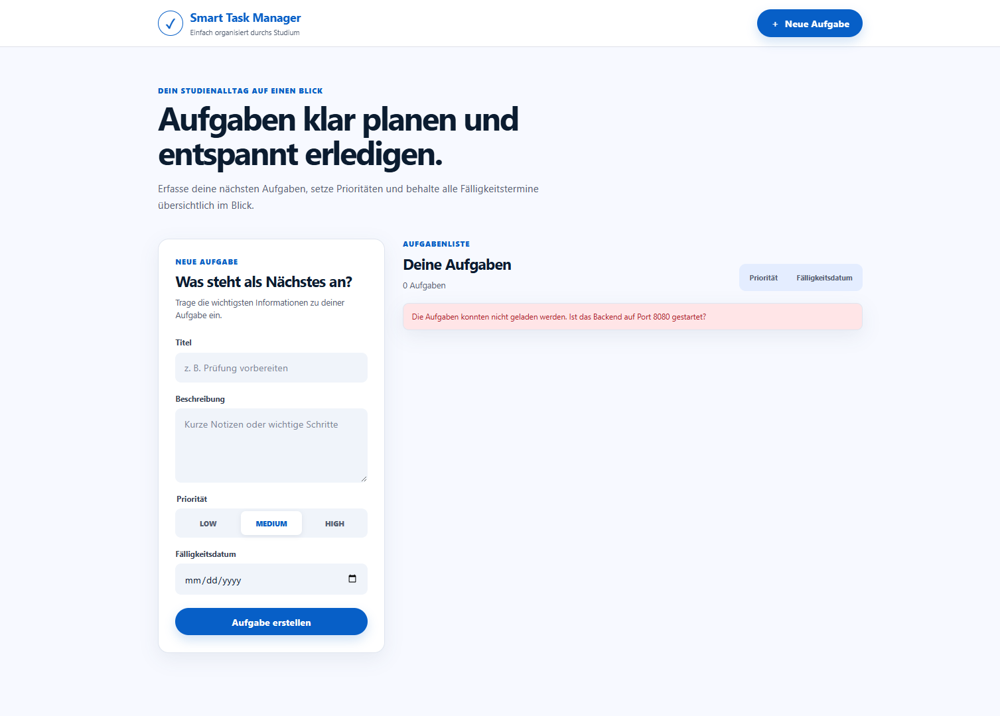

# Gesamtsystem und Fehlerfälle

## Ziel

In diesem Schritt wurde das vollständige System als Zusammenspiel aus Next.js-Frontend und Spring-Boot-Backend geprüft. Neben dem erfolgreichen Normalbetrieb wurde auch untersucht, wie sich das Frontend verhält, wenn das Backend nicht erreichbar ist.

## Aufbau des Gesamtsystems

- Browser als Benutzeroberfläche
- Next.js-Frontend auf Port 3000
- Spring-Boot-Backend auf Port 8080
- Kommunikation über HTTP und JSON
- Aufgabenverwaltung über den `TaskManager`
- Speicherung in einer In-Memory-Liste

Frontend und Backend sind zwei getrennte Anwendungen beziehungsweise Prozesse. Das Frontend kennt nur die REST-Schnittstelle und nicht die interne Umsetzung des Backends.

## Systemablauf

```text
Benutzer
  -> Browser
  -> Next.js-Frontend auf Port 3000
  -> HTTP / JSON
  -> Spring-Boot-Backend auf Port 8080
  -> TaskController
  -> TaskManager
  -> In-Memory-Aufgabenliste
```

- [Systemarchitektur öffnen](../diagrams/systemarchitektur.md)

## Start des Gesamtsystems

### Backend starten

```powershell
mvn -f backend/pom.xml spring-boot:run
```

Erwarteter erfolgreicher Start:

```text
Tomcat started on port 8080
Started SmartTaskManagerApplication
```

### Frontend starten

In einem zweiten Terminal:

```powershell
npm.cmd --prefix frontend run dev
```

Erwarteter erfolgreicher Start:

```text
Local: http://localhost:3000
Ready
```

Das Backend muss auf Port 8080 und das Frontend auf Port 3000 laufen. Beide Prozesse müssen für den vollständigen Normalbetrieb gleichzeitig aktiv sein.

## Erfolgreicher Normalbetrieb

1. Backend wurde gestartet.
2. Frontend wurde in einem zweiten Terminal gestartet.
3. Das Frontend lud die leere Aufgabenliste vom Backend.
4. Die Aufgabe „REST-API testen“ wurde im Frontend erstellt.
5. Das Formular wurde nach dem Erstellen geleert.
6. Eine Erfolgsmeldung wurde angezeigt.
7. Die neue Aufgabe erschien unmittelbar in der Aufgabenliste.
8. Die Aufgabe wurde als erledigt markiert.
9. Der Status wechselte von `OFFEN` zu `ERLEDIGT`.
10. Die Schaltfläche zum Abschließen wurde anschließend deaktiviert.
11. Die Aufgabe „Backend-Tests prüfen“ wurde als zweite Aufgabe erstellt.
12. Die Aufgaben wurden nach Fälligkeitsdatum sortiert.
13. Das Datum `18.07.2026` wurde vor dem Datum `20.07.2026` angezeigt.
14. Eine Testaufgabe wurde über das Frontend gelöscht.


## Geprüfter Fehlerfall: Backend nicht erreichbar

1. Das Backend war ausgeschaltet.
2. Nur das Next.js-Frontend wurde gestartet.
3. Die Seite wurde im Browser neu geladen.
4. Das Frontend versuchte, die Aufgaben über die REST-API zu laden.
5. Die Verbindung zu Port 8080 konnte nicht hergestellt werden.
6. Die Anwendung stürzte nicht ab.
7. Stattdessen wurde eine verständliche Fehlermeldung angezeigt.
8. Das Formular und die restliche Oberfläche blieben weiterhin sichtbar.

Angezeigter Text:

```text
Die Aufgaben konnten nicht geladen werden. Ist das Backend auf Port 8080 gestartet?
```



## Bewertung des Fehlerverhaltens

- Der technische Verbindungsfehler wird nicht ungefiltert angezeigt.
- Der Benutzer erhält eine verständliche Meldung.
- Die React-Anwendung bleibt weiterhin sichtbar und stürzt nicht ab.
- Der Fehlerzustand ist optisch von normalen Inhalten getrennt.
- Nach dem Start des Backends und einem erneuten Laden der Seite kann das Frontend wieder Daten abrufen.

Ein automatischer Wiederholungsversuch oder eine spezielle Wiederholen-Schaltfläche ist nicht vorhanden.

## In-Memory-Speicherung

Die Aufgaben werden derzeit nur im Arbeitsspeicher des Backends gespeichert. Dadurch ist keine Datenbank erforderlich und das Projekt bleibt einfach. Beim Beenden oder Neustarten des Backends bleiben die Aufgaben jedoch nicht dauerhaft erhalten. Diese In-Memory-Speicherung ist eine bewusste Vereinfachung des aktuellen Projektstands und kein unbeabsichtigter Programmfehler.

## Bereits durchgeführte Qualitätsprüfungen

Die folgenden Ergebnisse wurden bereits vor Schritt 07 erzielt und in diesem Schritt nicht erneut ausgeführt.

### Backend-Tests

```text
Tests run: 15
Failures: 0
Errors: 0
Skipped: 0
BUILD SUCCESS
```

### Frontend-Lint

```text
Keine ESLint-Fehler oder Warnungen
```

### Frontend-Build

```text
Compiled successfully
Finished TypeScript
Generating static pages
Build erfolgreich
```

## Kursbegriffe

- **Verteilte Anwendung:** Frontend und Backend laufen als getrennte Prozesse und kommunizieren über HTTP.
- **Client-Server-Architektur:** Das Frontend sendet Anfragen und das Backend verarbeitet sie.
- **Separation of Concerns:** Benutzeroberfläche, API-Zugriff, HTTP-Verarbeitung und Geschäftslogik sind getrennt.
- **Single Responsibility Principle:** Komponenten und Klassen besitzen klar abgegrenzte Aufgaben.
- **Geringe Kopplung:** Das Frontend ist nur von der REST-Schnittstelle abhängig, nicht von internen Java-Klassen.
- **Hohe Kohäsion:** Zusammengehörige Funktionen befinden sich in den dafür vorgesehenen Komponenten, Services und API-Dateien.
- **Fehlerbehandlung:** Verbindungsfehler werden abgefangen und als verständlicher Zustand dargestellt.
- **Robustheit:** Die Oberfläche bleibt auch dann sichtbar, wenn das Backend vorübergehend nicht erreichbar ist.
- **Testbarkeit:** Backend-Geschäftslogik und HTTP-Endpunkte werden durch automatisierte Tests geprüft.

## Persönliche Erfahrung

Beim Test des vollständigen Systems wurde deutlich, dass eine verteilte Anwendung von mehreren laufenden Prozessen abhängt. Wenn das Backend ausgeschaltet ist, kann das Frontend keine Aufgaben laden. Hilfreich war, dass die Seite dabei nicht abstürzte, sondern eine verständliche Meldung anzeigte. Dadurch ließ sich der Fehler schnell dem nicht gestarteten Backend zuordnen.

## Links

- [Verwendeten Prompt öffnen](../prompts/07-gesamtsystem-und-fehlerfaelle.md)
- [Frontend-Backend-Kommunikation öffnen](06-frontend-backend-kommunikation.md)
- [REST-API und Tests öffnen](04-rest-api-und-tests.md)
- [Statisches Next.js-Frontend öffnen](05-nextjs-frontend.md)
- [Systemarchitektur öffnen](../diagrams/systemarchitektur.md)
- [Zurück zur Haupt-README](../../README.md)
