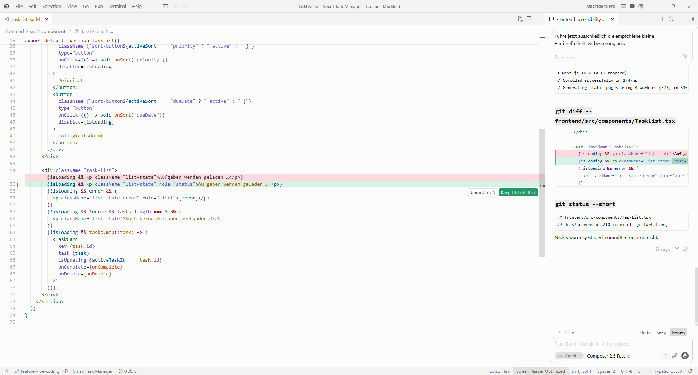
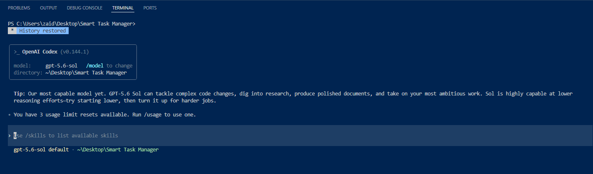
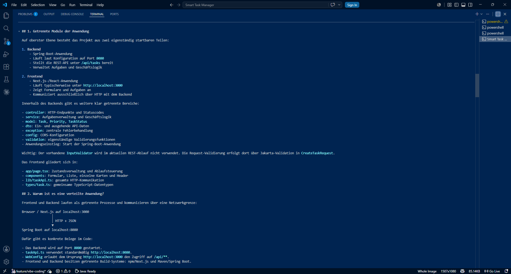

# Cursor und Codex CLI

## Ziel

Die Aufgabenstellung fordert die Nutzung einer CLI oder eines Visual-Studio-Code-Clones sowie den Nachweis, dass auch das jeweils andere Werkzeug installiert und verwendet wurde. Deshalb wurden sowohl Cursor als VS-Code-Clone als auch die Codex CLI praktisch am bestehenden Projekt eingesetzt.

## Verwendete Werkzeuge

- Cursor als Visual-Studio-Code-Clone
- OpenAI Codex CLI Version 0.144.1
- Normaler Projektordner: `C:\Users\zaid\Desktop\Smart Task Manager`

Cursor wurde für eine kleine echte Codeverbesserung verwendet. Die Codex CLI wurde für eine tatsächliche Analyse des vorhandenen Frontend- und Backend-Codes eingesetzt. Beide Werkzeuge wurden damit nicht nur geöffnet, sondern praktisch verwendet.

## Cursor: Analyse der Barrierefreiheit

Cursor analysierte diese Dateien:

- `frontend/src/app/page.tsx`
- `frontend/src/components/CreateTaskForm.tsx`
- `frontend/src/components/TaskList.tsx`

Das Ergebnis der Analyse war:

- Erfolgsmeldungen im Formular verwendeten bereits `role="status"`.
- Fehler in der Aufgabenliste verwendeten bereits `role="alert"`.
- Der Ladehinweis „Aufgaben werden geladen …“ besaß noch keine Live-Region.
- Cursor empfahl als kleinste Änderung `role="status"` für den Ladehinweis.

## Cursor: tatsächliche Codeänderung

Die einzige Änderung erfolgte in:

```text
frontend/src/components/TaskList.tsx
```

Vorher:

```tsx
{isLoading && <p className="list-state">Aufgaben werden geladen …</p>}
```

Nachher:

```tsx
{isLoading && <p className="list-state" role="status">Aufgaben werden geladen …</p>}
```

`role="status"` stellt eine höfliche Live-Region bereit. Screenreader können den dynamisch eingeblendeten Ladezustand dadurch ankündigen. Der sichtbare Text, das Design und das fachliche Verhalten blieben unverändert. Es wurde keine neue Funktion ergänzt.

## Prüfung der Cursor-Änderung

### ESLint

```text
npm.cmd --prefix frontend run lint
```

Ergebnis:

```text
Exit code: 0
Keine ESLint-Fehler
```

### Frontend-Build

```text
npm.cmd --prefix frontend run build
```

Ergebnis:

```text
Exit code: 0
Compiled successfully
Generating static pages erfolgreich
```



## Codex CLI: Installation und Start

Startbefehl:

```powershell
codex.cmd
```

Angezeigte Version:

```text
OpenAI Codex v0.144.1
```

Richtiger Projektordner:

```text
~/Desktop/Smart Task Manager
```



## Codex CLI: tatsächliche Projektanalyse

Die Codex CLI las und analysierte den realen Code unter `backend/` und `frontend/`. Die Analyse behandelte:

- getrennte Module
- verteilte Anwendung
- vollständigen Ablauf beim Erstellen einer Aufgabe
- Verantwortungen wichtiger Klassen und Komponenten
- Separation of Concerns
- Single Responsibility Principle
- geringe Kopplung
- hohe Kohäsion
- Lade-, Leer-, Erfolgs- und Fehlerzustände
- Einschränkungen der In-Memory-Speicherung
- wichtigste Belegdateien

Die Codex CLI änderte keine Dateien. Die Analyse basierte auf dem tatsächlich vorhandenen Code. `git status --short` wurde durch die CLI geprüft. Bereits vorhandene Änderungen und Screenshots wurden nur erkannt, nicht verändert.



## Nachweis des Codeverständnisses

```text
Benutzer füllt CreateTaskForm aus
  -> CreateTaskForm ruft onCreate auf
  -> page.tsx führt handleCreate aus
  -> taskApi.ts sendet POST /api/tasks
  -> Spring deserialisiert den JSON-Body als CreateTaskRequest
  -> Bean Validation prüft die Pflichtfelder
  -> TaskController delegiert an TaskManager
  -> TaskManager erstellt und speichert Task in der In-Memory-Liste
  -> TaskController wandelt Task in TaskResponse um
  -> Backend antwortet mit 201 Created und JSON
  -> taskApi.ts liest die Antwort
  -> page.tsx aktualisiert den React-State
  -> TaskList und TaskCard zeigen die neue Aufgabe
  -> CreateTaskForm leert die Felder und zeigt die Erfolgsmeldung
```

## Verantwortungen im Projekt

| Datei oder Klasse | Verantwortung |
|---|---|
| `CreateTaskForm.tsx` | Verwaltet die Formulareingaben, ruft `onCreate` auf und zeigt Erfolg oder Fehler an. |
| `page.tsx` | Verwaltet den React-State und koordiniert Laden, Erstellen, Abschließen, Löschen und Sortieren. |
| `taskApi.ts` | Bündelt die HTTP-Aufrufe zur REST-API und verarbeitet deren Antworten. |
| `TaskList.tsx` | Zeigt Listen-, Lade-, Leer- und Fehlerzustände und löst die Sortierung aus. |
| `TaskCard.tsx` | Stellt eine einzelne Aufgabe und deren Aktionen zum Abschließen und Löschen dar. |
| `TaskController` | Verarbeitet die HTTP-Anfragen, delegiert an den `TaskManager` und erzeugt API-Antworten. |
| `TaskManager` | Enthält die Aufgabenlogik und verwaltet die In-Memory-Aufgabenliste. |
| `CreateTaskRequest` | Nimmt die Daten zum Erstellen einer Aufgabe entgegen und definiert die Bean Validation. |
| `TaskResponse` | Beschreibt die nach außen zurückgegebenen Aufgabendaten. |
| `GlobalExceptionHandler` | Übersetzt fachliche und ungültige Anfragen in einheitliche HTTP-Fehlerantworten. |
| `WebConfig` | Erlaubt kontrollierte CORS-Zugriffe des lokalen Frontends auf die Backend-API. |

## Architekturprinzipien

- **Separation of Concerns:** Darstellung, Zustandskoordination, API-Zugriff, HTTP-Verarbeitung, Geschäftslogik und Fehlerbehandlung sind getrennt.
- **Single Responsibility Principle:** Formular, Liste, Karte, Controller, Service und Konfiguration haben jeweils klar abgegrenzte Aufgaben.
- **Geringe Kopplung:** React-Komponenten kommunizieren über Properties und Callbacks; Frontend und Backend kennen einander nur über HTTP und JSON.
- **Hohe Kohäsion:** API-Aufrufe liegen gemeinsam in `taskApi.ts`, Aufgabenlogik im `TaskManager` und Fehlerübersetzung im `GlobalExceptionHandler`.
- **DTO:** `CreateTaskRequest`, `TaskResponse` und `ApiError` bilden den API-Vertrag, ohne das interne Modell direkt freizugeben.

## Bewusste Einschränkung

- Aufgaben werden nur in einer `ArrayList<Task>` gespeichert.
- Beim Backend-Neustart gehen Aufgaben verloren.
- Die ID-Vergabe beginnt nach einem Neustart wieder bei 1.
- Es gibt bewusst keine Datenbank.
- Diese In-Memory-Speicherung hält das Projekt verständlich und einfach.
- Soft-gelöschte Aufgaben bleiben intern bis zum Neustart erhalten, werden aber aus normalen Ergebnissen herausgefiltert.

## Erfüllung des Werkzeugteils der Aufgabenstellung

Ein VS-Code-Clone wurde installiert und tatsächlich für eine Codeänderung verwendet: Cursor. Eine CLI wurde installiert und tatsächlich zur Analyse des realen Projekts verwendet: Codex CLI. Die Screenshots belegen Start, Nutzung und Ergebnis. Damit wurde nicht nur die Installation, sondern auch die praktische Verwendung beider Werkzeugarten nachgewiesen.

## Persönliche Erfahrung

Cursor war hilfreich, um eine sehr kleine Verbesserung direkt im bestehenden Frontend zu finden und umzusetzen. Die Codex CLI eignete sich dagegen gut für eine ausführliche Analyse des gesamten Projekts. Besonders hilfreich war die Erklärung des vollständigen Datenflusses vom Formular bis zum Backend und wieder zurück. Dadurch konnte ich die Verantwortungen der einzelnen Module noch einmal nachvollziehen.

## Links

- [Verwendete Prompts öffnen](../prompts/08-codex-cli-und-cursor.md)
- [Frontend-Backend-Kommunikation öffnen](06-frontend-backend-kommunikation.md)
- [Gesamtsystem und Fehlerfälle öffnen](07-gesamtsystem-und-fehlerfaelle.md)
- [Java-Backend-Struktur öffnen](03-java-backend-struktur.md)
- [Systemarchitektur öffnen](../diagrams/systemarchitektur.md)
- [Zurück zur Haupt-README](../../README.md)
